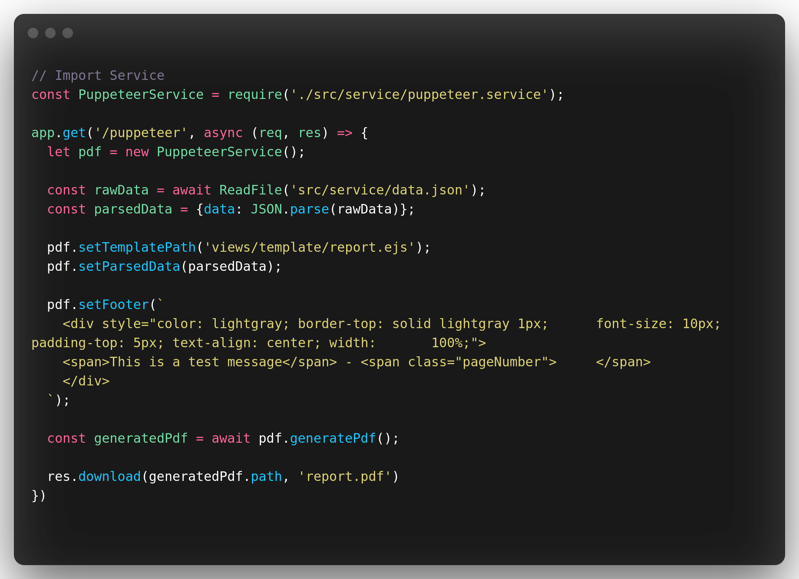

# pdf-test

## Description

pdf-test is a clean formatted integration of the google puppeteer addon for generate pdf report

## Prerequisite and install

1. Install in your project puppeteer with NPM: `npm i puppeteer`
2. [optionally] Install in your project uuid: `npm install uuid` or change the name generation otherwise
3. Recover and import ServicePuppeter file located in "/src/service/ServicePuppeteer" of this repository to your project

## Generate an PDF

For generating pdf with PuppeteerService, first you need to import the class named servicePuppeteer where he is located

`const PuppeteerService = require('./src/service/puppeteer.service');`

### Use

`const pdf = new PuppeteerService(name, logo, header, footer, parsedData, templatePath);`

### Methods

* `pdf.setHeader(String html);`
* `pdf.setFooter(String html);`
* `pdf.setTemplatePath(String path);`
* `pdf.setParsedData(JSON parsedData);`
* `pdf.generatePdf();`

### Use Rest example

  

see the real integration at the following url: https://github.com/Zachari-Blinn/pdf-test/blob/master/server.js
